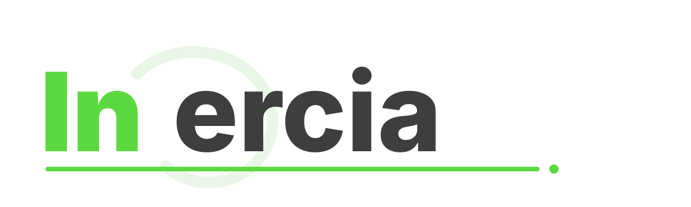
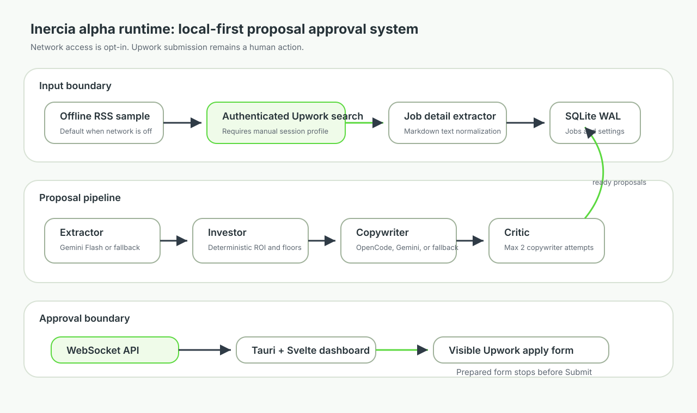

<div align="center">
  

  <p><strong>Local alpha desktop workflow for finding, scoring, drafting, and manually approving Upwork proposals.</strong></p>

  <p>
    
    
    
    
    
    
  </p>
</div>

> [!WARNING]
> Inercia is still under active development. Treat the current repository as alpha software: there are several bugs and rough edges, live Upwork selectors can break without notice, and no workflow should be run unattended with real connects or account risk.

## What Inercia Does

Inercia is a local-first proposal assistant for Upwork. It collects jobs from either an offline RSS fixture or an explicitly enabled authenticated Upwork search session, stores normalized jobs in SQLite, scores each job with Gemini ROI analysis constrained by deterministic hard gates, drafts proposal text through an AI pipeline with deterministic fallbacks, and exposes pending proposals in a Tauri/Svelte dashboard for human approval.

The project is not a submit bot. The live apply path opens a visible Upwork application form, fills fields when selectors still match, and stops before the final Submit action. The human operator remains responsible for reviewing text, checking the Upwork page, and deciding whether to submit.

## Current Alpha Posture

| Area | Current state |
| :--- | :--- |
| Release maturity | `0.3.0a0` alpha. Expect bugs, selector drift, incomplete packaging, and behavior that needs manual verification. |
| Default network mode | Offline. `ALLOW_UPWORK_NETWORK=false` uses local mock RSS and mock job details. |
| Live Upwork mode | Opt-in only. Requires a manually created Chromium profile and a verified logged-in Upwork session. |
| Submission behavior | The code intentionally stops before Submit. Approval prepares the form and logs local connect spend. |
| AI dependencies | Native Gemini structured output is used for extraction, ROI scoring, copywriting, and critic review when configured. Every node has a deterministic fallback. |
| CV generation | A Typst CV builder exists, but the default proposal pipeline currently does not attach generated PDFs automatically. |
| Security model | Single-user local app. The WebSocket API binds to localhost by default and is not designed as a multi-user service. |

## Core Capabilities

| Capability | Runtime responsibility | Main files |
| :--- | :--- | :--- |
| Offline scraping fixture | Develop and test without touching Upwork. | `src/inercia/scraper/feed.py`, `src/inercia/scraper/job_detail.py` |
| Authenticated discovery | Use the stored Upwork browser profile, apply configured filters, ignore stale jobs, and skip known blacklist terms. | `src/inercia/scraper/filter_scraper.py`, `src/inercia/applicator/auth.py` |
| Detail extraction | Convert job pages or fixtures into compact markdown for pipeline processing. | `src/inercia/scraper/job_detail.py` |
| ROI scoring | Score jobs using skill overlap, connect cost, client spend, hire rate, reviews, floor rates, and blacklist keywords. | `src/inercia/ai/nodes/investor.py` |
| Proposal drafting | Produce cover letters and screening answers through Gemini Pro, with deterministic offline output when keys are missing. | `src/inercia/ai/nodes/copywriter.py`, `src/inercia/ai/llm.py` |
| Critic pass | Reject template-like openings, excessive length, missing signature, forbidden phrasing, and weak screening answers. | `src/inercia/ai/nodes/critic.py` |
| Local persistence | Store jobs, proposals, connect logs, runtime settings, and migration defaults in SQLite. | `src/inercia/db/schema.sql`, `src/inercia/db/manager.py` |
| Desktop approval UI | Show pending proposals, stats, connects, jobs, scraper controls, login state, and settings. | `ui/src/App.svelte`, `ui/src/lib/stores/proposals.ts` |
| Tauri shell | Start the Python API sidecar, inject the WebSocket port, and host the Svelte UI. | `src-tauri/src/main.rs`, `src-tauri/tauri.conf.json` |

## Architecture



The project has three important trust boundaries:

1. Network boundary: live Upwork access only happens when `ALLOW_UPWORK_NETWORK=true` or the UI sends a live scrape request.
2. Approval boundary: the WebSocket `user_approved` message prepares the visible apply page, but `prepare_application` must report `stopped_before_submit=True` before local approval is recorded.
3. Secret boundary: API keys are read from `.env`, process environment, or SQLite session settings. The settings payload sent to the UI redacts stored secret values and only exposes boolean `has_*_key` flags.

## Execution Paths

### Offline Development Path

```text
python -m inercia scrape "python playwright"
  -> local mock RSS feed
  -> mock job detail markdown
  -> SQLite jobs table

python -m inercia process --limit 5
  -> extractor fallback or Gemini
  -> investor fallback or Gemini Flash
  -> copywriter fallback or Gemini Pro
  -> critic fallback or Gemini
  -> pending proposal rows
```

This path is the safest way to verify the app because it does not contact Upwork.

### Live Discovery Path

```text
manual Upwork login profile
  -> authenticated search page
  -> configured filters and max-connect screen
  -> job cards newer than the last scraped marker
  -> detail extraction
  -> SQLite
  -> proposal pipeline
  -> dashboard notification
```

Live discovery depends on Upwork DOM selectors in `src/inercia/scraper/selectors.py`. Those selectors are expected to break over time because Upwork is a changing SPA.

### Approval Path

```text
Tauri/Svelte Accept button
  -> WebSocket user_approved
  -> verify daily proposal cap
  -> verify Upwork session if live network is enabled
  -> open visible apply form
  -> fill rate, cover letter, screening answers, and available attachments
  -> stop before Submit
  -> update local status and connects log
```

In offline mode, approval uses the mock apply result and still updates local proposal/connect state. In live mode, inspect the opened Upwork page before submitting manually.

## Repository Layout

```text
.
|-- README.md
|-- pyproject.toml
|-- .env.example
|-- docs/assets/
|   |-- inercia-logo.svg
|   `-- inercia-architecture.svg
|-- src/inercia/
|   |-- __main__.py              # CLI entry point: init-db, scrape, process, api
|   |-- config.py                # Env, DB-backed runtime settings, defaults
|   |-- api/                     # WebSocket protocol and server handlers
|   |-- applicator/              # Login/session probing and apply-form preparation
|   |-- ai/                      # LangGraph-compatible pipeline nodes and schemas
|   |-- core/                    # Scrape orchestration and scheduler loop
|   |-- cv/                      # Typst CV source rendering and compile helper
|   |-- db/                      # SQLite schema, migrations, CRUD helpers
|   `-- scraper/                 # RSS, authenticated search, detail extraction, selectors
|-- ui/
|   |-- package.json
|   `-- src/                     # Svelte 5 dashboard, stores, panels, proposal cards
|-- src-tauri/
|   |-- Cargo.toml
|   |-- tauri.conf.json
|   `-- src/main.rs              # Tauri app and Python sidecar lifecycle
`-- tests/                       # unittest coverage for DB, parsing, settings, auth state
```

## Prerequisites

| Requirement | Why it is needed |
| :--- | :--- |
| Python 3.11 or newer | Python package, CLI, API server, scraper, AI pipeline, SQLite logic. |
| Node.js and npm | Svelte 5 development server, type checking, and production build. |
| Rust and Cargo | Tauri v2 desktop shell and Linux package targets. |
| Tauri CLI | `cargo tauri dev` and Tauri builds. |
| Playwright Chromium | Headless scraping and session probing through the Python Playwright package. |
| System Chromium or Chrome | The login browser opened by the API searches for `chromium`, `google-chrome`, or `google-chrome-stable`. |
| Typst CLI | Optional today. Required only when calling the CV PDF builder directly. |
| Upwork account | Required only for live network mode. The app does not automate login creation, CAPTCHA, MFA, or access controls. |
| Gemini API key | Optional. Missing keys trigger deterministic fallbacks for local development and tests. |

## Installation

From the repository root:

```bash
python -m venv .venv
source .venv/bin/activate
python -m pip install --upgrade pip
python -m pip install -e .
python -m playwright install chromium
```

Install the UI dependencies:

```bash
npm --prefix ui install
```

Install the Tauri CLI if it is not already available:

```bash
cargo install tauri-cli
```

Initialize the local database:

```bash
python -m inercia init-db
```

The Tauri development shell expects to find the project-local `.venv` and `src/inercia` when it resolves the project root.

## Configuration

Copy the template and edit local values:

```bash
cp .env.example .env
```

Settings are resolved in this order:

1. SQLite `sessions` table values written by the UI.
2. Process environment variables.
3. `.env` values in the project root.
4. Defaults from `src/inercia/config.py`.

| Setting | Default | Purpose |
| :--- | :--- | :--- |
| `GEMINI_API_KEY` | empty | Enables native Gemini structured calls across the AI pipeline. |
| `UPWORK_SESSION_DIR` | `.upwork-session` | Persistent browser profile for manual Upwork login and live scraping. |
| `DB_PATH` | `inercia.db` | SQLite database path. |
| `DAILY_PROPOSAL_CAP` | `12` | Maximum submitted proposals allowed per day before pipeline/approval stops. |
| `WS_PORT` | `9741` | Local WebSocket API port. |
| `LOGIN_DEBUG_PORT` | `9742` | Local Chrome remote-debugging port used only for login status inspection. |
| `FLOOR_HOURLY_RATE` | `35` | Minimum hourly bid and ROI floor. |
| `FLOOR_FIXED_RATE` | `50` | Minimum fixed-price bid and ROI floor. |
| `ALLOW_UPWORK_NETWORK` | `false` | Enables live Upwork scraping/apply preparation when set to true. |
| `SCHEDULER_INTERVAL_MIN_MINUTES` | `5` | Lower bound for randomized scheduler delay. |
| `SCHEDULER_INTERVAL_MAX_MINUTES` | `15` | Upper bound for randomized scheduler delay. |
| `blacklist_keywords` | JSON list | Keyword kill list used by scraper filtering and ROI scoring. |
| `upwork_search_filters` | JSON object | Categories, experience, job type, budget, client, proposal-count, and max-connect filters. |
| `portfolio_attachments` | JSON list | Local file paths attached during live apply preparation if they exist. |

The generated `.env`, SQLite database, Upwork browser profile, virtual environment, and PDFs are ignored by `.gitignore`.

## Quick Start

Run a full offline cycle:

```bash
python -m inercia init-db
python -m inercia scrape "python playwright"
python -m inercia process --limit 5
python -m inercia api
```

In another terminal, run the Svelte UI against the local API:

```bash
npm --prefix ui run dev
```

Open `http://127.0.0.1:1420`.

To run the Tauri shell instead:

```bash
cd src-tauri
cargo tauri dev
```

The Tauri app starts the Python API sidecar automatically, injects the selected WebSocket port into the frontend, and runs the UI dev server through `tauri.conf.json`.

## CLI Reference

| Command | Effect |
| :--- | :--- |
| `python -m inercia` | Print the configured version and database path. |
| `python -m inercia --version` | Print the Python package version. |
| `python -m inercia init-db` | Create or migrate the SQLite database and seed runtime session defaults. |
| `python -m inercia scrape <query>` | Run offline scraping with the mock RSS/detail path. |
| `python -m inercia scrape <query> --allow-network` | Run live scraping with authenticated Upwork search and detail extraction. |
| `python -m inercia process --limit 20` | Process new jobs through the proposal pipeline. |
| `python -m inercia api` | Start the localhost WebSocket API on `WS_PORT`. |
| `python -m inercia api --host 0.0.0.0 --port 8080` | Bind the WebSocket server to a custom host/port. Use with care; the API has no multi-user auth layer. |

## Live Upwork Login

The dashboard can open a visible login browser through the API. The browser uses `UPWORK_SESSION_DIR` as its Chrome profile and exposes a local debugging endpoint on `LOGIN_DEBUG_PORT` so Inercia can detect when login reaches a known authenticated Upwork page.

Manual login rules:

- Log in yourself. Inercia does not submit credentials.
- Complete MFA, CAPTCHA, profile completion, or any access-control step manually.
- Wait for an authenticated page such as Find Work to finish loading.
- Close the login browser before starting live scraping or approving proposals.
- Protect `.upwork-session/`; it contains account cookies and is intentionally ignored by Git.

## Database Model

SQLite runs with WAL mode and foreign keys enabled. The schema uses `STRICT` tables.

| Table | Purpose |
| :--- | :--- |
| `jobs` | Scraped job rows, source metadata, normalized fields, ROI score, and job lifecycle status. |
| `proposals` | Drafted cover letter, screening answers, bid, critic metadata, status, and optional CV path. |
| `connects_log` | Local connect spend/refund records. Approval logs spend before manual Upwork submission confirmation. |
| `sessions` | Runtime settings, search filters, blacklist keywords, portfolio attachments, and stored connect balance. |

Useful inspection queries:

```sql
SELECT id, title, source, roi_score, status
FROM jobs
ORDER BY scraped_at DESC
LIMIT 20;

SELECT proposals.id, jobs.title, proposals.roi_score, proposals.connects_cost, proposals.status
FROM proposals
JOIN jobs ON jobs.id = proposals.job_id
ORDER BY proposals.created_at DESC;
```

## AI Pipeline

The pipeline is LangGraph-compatible and has a local fallback runner when LangGraph is unavailable.

```text
Extractor
  -> Gemini Flash structured extraction or deterministic parser

Investor
  -> Gemini Flash ROI score or deterministic ROI fallback
  -> blacklist and floor-rate checks
  -> route low ROI jobs to blacklisted

Copywriter
  -> Gemini Pro when GEMINI_API_KEY is set
  -> otherwise deterministic letter and screening-answer fallback

Critic
  -> Gemini Pro review or deterministic review
  -> one retry back to Copywriter when issues are found and attempts remain
```

The investor threshold is `ROI_THRESHOLD = 6.0`.

```text
roi  = 40 * skill_overlap
roi -= 20 * (connects_required / 16)
roi += 20 * min(client_total_spent / 10000, 1)
roi += 10 * client_hire_rate
roi += 10 * min(client_reviews / 20, 1)
```

Blacklisted keywords set ROI to `-100`. Low fixed budgets and low hourly rates subtract additional penalties based on the configured floor values.

## WebSocket API

The API sends initial state to each client, then polls every two seconds for ready proposals, stats, scheduler status, and login status. The UI sends JSON messages such as:

| Client message | Server behavior |
| :--- | :--- |
| `run_scrape` | Start scrape in the background and return scrape progress/done/error messages. |
| `run_process` | Start proposal processing in the background and return process progress/done messages. |
| `user_approved` | Validate caps/session, prepare the apply form, update local status, and log connects. |
| `user_rejected` | Close any apply session and mark proposal/job rejected. |
| `confirm_submitted` | Mark local proposal/job submitted after the human submits on Upwork. |
| `open_upwork_login` | Launch system Chromium/Chrome for manual login. |
| `get_jobs` | Return stored jobs for the Jobs panel. |
| `set_setting` | Persist supported runtime settings to SQLite sessions. |
| `start_scheduler` | Start randomized scrape/process cycles using configured filters. |

## Operations and Security Notes

- Keep the WebSocket host on `127.0.0.1` unless you add authentication and network controls yourself.
- Keep `ALLOW_UPWORK_NETWORK=false` until the offline path works and you understand the selector/apply behavior.
- The login profile stores cookies. Do not commit or share `.upwork-session/`.
- Approval logs local connects as spent. If you abandon the Upwork form without submitting, correct the local state manually before relying on connect totals.
- The scraper blocks images, media, and fonts to reduce load, but it does not bypass bot detection, CAPTCHA, MFA, or rate limits.
- `src/inercia/scraper/selectors.py` is the first place to inspect when live scraping or apply preparation stops finding fields.
- No license file is present in this repository at the time of writing.

## Testing and Verification

Run the Python behavior tests:

```bash
PYTHONPATH=src python -m unittest discover -s tests
```

Run Svelte type checks and build checks:

```bash
npm --prefix ui run check
npm --prefix ui run build
```

Run the Tauri Rust check:

```bash
cd src-tauri
cargo check
```

Verify README images, icons, and badges:

```bash
python /home/alaska45l/.codex/skills/create-readme/scripts/verify_readme_assets.py README.md
```

## Troubleshooting

| Symptom | Likely cause | Fix |
| :--- | :--- | :--- |
| `WebSocket connection failed` in the UI | Python API is not running or `WS_PORT` does not match the frontend port. | Start `python -m inercia api`, or let Tauri start the sidecar, then refresh the UI. |
| Login browser will not open | No system Chromium/Chrome binary is on PATH. | Install `chromium`, `google-chrome`, or `google-chrome-stable`. |
| `Upwork session profile is already in use` | Another Chrome/Playwright process owns `.upwork-session/`. | Close the login, scraping, or apply browser before retrying. |
| Live scrape returns login errors | Stored cookies are expired or login did not finish on an authenticated page. | Open the login browser from the UI, complete login manually, wait for Find Work, then close it. |
| Live scrape finds no jobs | Filters are too strict, max connects is too low, or selectors drifted. | Review settings in the UI and inspect `src/inercia/scraper/selectors.py`. |
| Proposal processing creates blacklisted jobs only | Blacklist keywords, floor rates, connect cost, or low client history dominate ROI. | Tune settings from the UI or edit the JSON defaults carefully. |
| Apply preparation does not fill a field | Upwork changed the form selector or the field is not present for that job. | Inspect the visible form manually and update selectors if needed. |
| `typst CLI is not available in PATH` | CV builder was called without Typst installed. | Install Typst or skip CV PDF compilation until that integration is needed. |

## Known Alpha Gaps

- Tauri development assumes a local `.venv`; packaged sidecar distribution is not complete.
- Live Upwork selectors and page flows are fragile and need regular maintenance.
- The CV builder is implemented but not wired into automatic proposal persistence.
- There is no multi-user authentication layer for the WebSocket API.
- Connect accounting is local and depends on the user confirming or correcting real Upwork outcomes.
